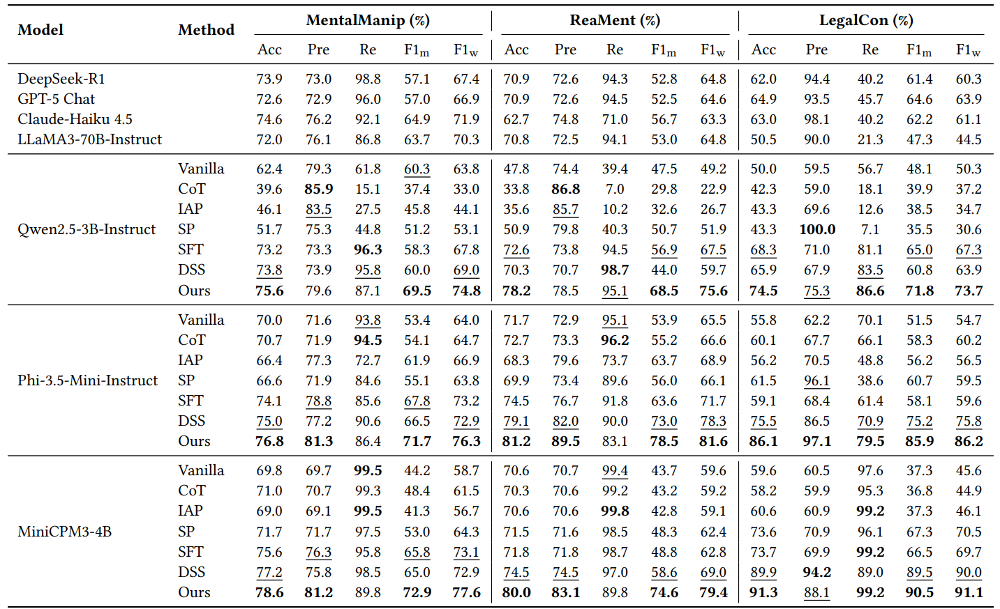
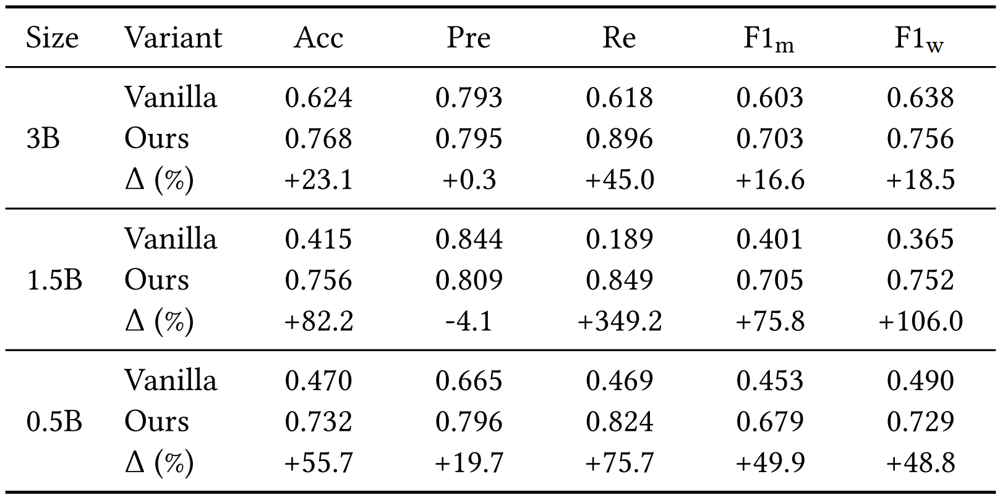
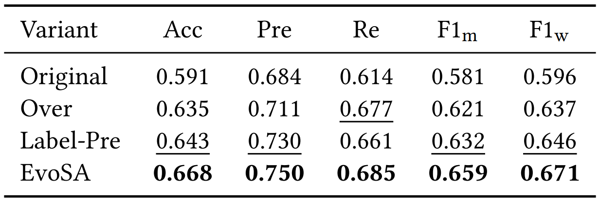

<div align="center"> <h2>
 <strong>Boosting Large Language Models for Mental Manipulation Detection via<br>Data Augmentation and Distillation</strong></h2>
 
  [](https://arxiv.org/abs/2505.15255)
  
  [](https://huggingface.co/datasets/YSGao/ReaMent)
</div>

<p align="center"> MentalMAD is a framework designed to detect mental manipulation in dialogues. It improves large language models (LLMs) using innovative data augmentation (EvoSA + complementary tasks) and knowledge distillation (CoCoDistill) techniques, specifically crafted for detecting covert, multi-turn manipulative behavior in conversations.</p>

<p align="center">

</p>

---

## 🚀 Features

- **Annotation-free Data Augmentation (EvoSA)**: Combines evolutionary operations and speech-act-aware prompting to generate new dialogue samples, preserving labels and ensuring coherence.
- **Knowledge Distillation (CoCoDistill)**: A phase-wise distillation approach that transfers manipulation-specific knowledge from a teacher model to improve detection performance in a student model.
- **ReaMent Dataset**: A human-annotated dataset of 5,000 real-world dialogues sourced from unscripted web videos, designed for training and evaluation.
- **State-of-the-Art Performance**: Outperforms current LLM-based models with significant improvements in accuracy, F1-macro, and F1-weighted scores.

---

## 📑 Table of Contents

- [Installation](#installation)
- [Dataset](#dataset)
- [Usage](#usage)
  - [Preprocess Data](#1-preprocess-data)
  - [Train Model](#2-train-model)
  - [Run Inference](#3-run-inference)
- [Model Architecture](#model-architecture)
  - [EvoSA](#evosa)
  - [CoCoDistill](#cocodistill)
- [Performance](#performance)
- [License](#license)
- [Contact](#contact)
- [Citations](#citations)
---

## <a name="installation"></a>💻 Installation

To get started, clone this repository and install the required dependencies:

```bash
git clone https://github.com/Yuansheng-Gao/MentalMAD.git
cd MentalMAD
pip install -r requirements.txt
```

## <a name="dataset"></a>📂 Dataset

**ReaMent** is a dataset consisting of 5,000 human-annotated dialogues sourced from unscripted web videos. This dataset was specifically constructed to help address the lack of real-world data for mental manipulation detection.

For detailed instructions on how to access or contribute to the dataset, please refer to the [dataset documentation](#).

---

## <a name="usage"></a>⚙️ Usage

### 1. Augment Data

Before training the model, augment the dataset:

```bash
python EvoSA.py --input_path <input_data_path> --output_path <output_data_path>
python complementary_task_generation.py --input_path ./dataset/MentalManip_con_train.json --output_path ./data_for_CoCoDistill/MentalManip_con_correct_data.json --data_type correct
python complementary_task_generation.py --input_path ./dataset/MentalManip_con_train.json --output_path ./data_for_CoCoDistill/MentalManip_con_incorrect_data.json --data_type incorrect
python complementary_task_generation.py --input_path ./dataset/MentalManip_con_train.json --incorrect_output ./data_for_CoCoDistill/MentalManip_con_incorrect_data.json --feedback_output ./data_for_CoCoDistill/MentalManip_con_feedback_data.json --data_type feedback

```

### 2. Train Model

Train the **MentalMAD** model using the preprocessed data:

```bash
python main.py --data <preprocessed_data_path> --output <model_output_path>
```

### 3. Run Inference

Once the model is trained, run inference on new data:
```bash
python test.py --input <input_data_path> --model <trained_model_path> --output <inference_results_path>
```

---

## <a name="model-architecture"></a>🧠 Model Architecture

### <a name="evosa"></a>EvoSA: Annotation-free Data Augmentation

EvoSA combines evolutionary operations and speech-act-aware prompting to create new dialogues by selecting distinct utterances from two parent dialogues with the same label. This method preserves label consistency while generating diverse and natural dialogue variants, making it a powerful tool for data augmentation.

### <a name="cocodistill"></a>CoCoDistill: Complementary-Convergence Distillation

CoCoDistill uses a phase-wise strategy to distill knowledge from a teacher model to a student model. It begins by training on multiple tasks and then progressively focuses on the core task of binary classification, improving the model's ability to detect manipulation-specific cues in dialogues.

---

## <a name="performance"></a>📊 Performance

### Comparison with Baselines

<p align="left">

</p>

### Performance of Models Across Different Sizes

<p align="left">

</p>

### Evaluation of EvoSA’s Contribution

<p align="left">

</p>

---

## <a name="license"></a>📝 License

This project is licensed under the **MIT License**. See the [LICENSE](LICENSE) file for more details.

---

## <a name="contact"></a>📫 Contact

For questions, contributions, or inquiries, feel free to reach out:

**Yuansheng Gao**: [y.gao@zju.edu.cn](mailto:y.gao@zju.edu.cn)

## <a name="citations"></a>📚 Citations

If you use this repository or the ReaMent dataset in your research, please cite the following paper:

```
@misc{gao2026boostinglargelanguagemodels,
      title={Boosting Large Language Models for Mental Manipulation Detection via Data Augmentation and Distillation}, 
      author={Yuansheng Gao and Peng Gao and Han Bao and Bin Li and Jixiang Luo and Zonghui Wang and Wenzhi Chen},
      year={2026},
      eprint={2505.15255},
      archivePrefix={arXiv},
      primaryClass={cs.CL},
      url={https://arxiv.org/abs/2505.15255}, 
}
```

